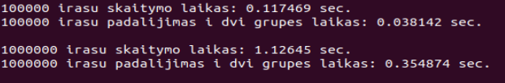
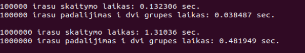
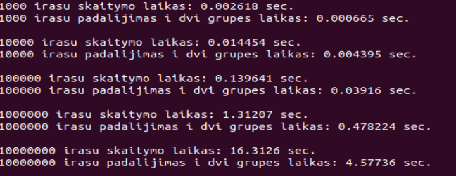
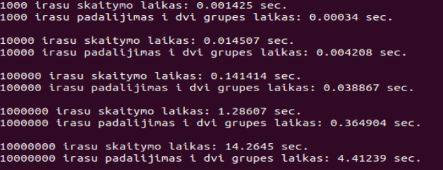
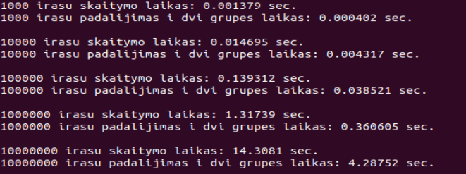

# 2uzduotis

## Versija v1.1

Šioje versijoje yra pakeista iš struct į class tipo duomenų saugojimą. Atlikti bandymai naudojant vector konteinerį su struktūra bei klase. Atlikti bandymai su skirtingais optimizavimo flag'ais O1, O2, O3. 
Ankstesni bandymai su struktūromis:  
 
Testavimas su clasėmis:  
 
Rezultatai rodo, kad naudodami klasę programa veikia 1.2 karto lėčiau negu su struktūromis. 
 

O1 flag: 
 
O2 flag: 
 
O3 flag: 
 

Rezultatai rodo, kad dirbant su klasėmis, optimizuojant su flag'ais programos veikimo sparta beveik visiškai nepakinta.

## Versija v1.2

Šioje versijoje pridėti klasės operatoriai '=' bei '<<' tam kad programa galėtų naudotis paprasčiau. Operatorius '=' leidžia prilyginti vienus klasės elementus kitiems. O operatorius '<<' palegvina failų išvedimą.
