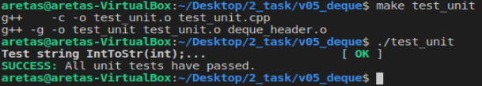

# 2uzduotis

## Versija v1.1

Šioje versijoje yra pakeista iš struct į class tipo duomenų saugojimą. Atlikti bandymai naudojant vector konteinerį su struktūra bei klase. Atlikti bandymai su skirtingais optimizavimo flag'ais O1, O2, O3. 
Ankstesni bandymai su struktūromis:  
 
Testavimas su clasėmis:  
 
Rezultatai rodo, kad naudodami klasę programa veikia 1.2 karto lėčiau negu su struktūromis. 
 

O1 flag: 
 
O2 flag: 
 
O3 flag: 
 

Rezultatai rodo, kad dirbant su klasėmis, optimizuojant su flag'ais programos veikimo sparta beveik visiškai nepakinta.

## Versija v1.2

Šioje versijoje pridėti klasės operatoriai '=' bei '<<' tam kad programa galėtų naudotis paprasčiau. Operatorius '=' leidžia prilyginti vienus klasės elementus kitiems. O operatorius '<<' palegvina failų išvedimą.
## Versija v1.5

Šioje versijoje vietoje turimos Studentas klasės sukurtos dvi: viena bazinė klasė, kuri aprašo žmogaus vardą ir pavardę ir iš jos išvesta derived klasė Studentas. Žmogui aprašyti skirta bazinė klasė yra abstrakčioji t.y. negalima kurti šios tipo objektų, o tik objektus gautus iš išvestinių klasių.

## Versija v2.0

Tai galutinė programos versija. Šioje versijoje pridėta doxygen dokumentacija, kuri yra doxygen kataloge. Pridėtas unit testavimas naudojant "acutest.h" failą. 
 
Unit testing using acutest
 

# Įdiegimo instrukcija

Norint sukompiliuoti ir paleisti programos vykdomajį failą, reikia naudojant Makefile įvesti komandą "make". Tada sukompiliavus main.cpp ir header.cpp failams bus sukurtas vykdomasis failas "main", kuris bus paleidžiamas "./main" komanda. Norint pratestuoti programą reikia paleisti komandą "make test_unit", bei ją paleisti įvedant "./test_unit".

# Naudojimosi instrukcija

Paleidus programą ji automatiškai generuos skirtingą mokinių skaičių turinčius failus, kuriuos ji pati ir apdoroja. Naudotojas atitinkamai pagal savo nuožiūrą gali keisti pagal ką jis nori rūšiuoti studentus(pvz.: pagal vardą, pagal pavardę, pagal galutinį įvertinimą), naudojant vis kitą funkciją. Naudotojas keisdamas number_of_files kintamąjį atitinkamai keis generuojamų programos failų skaičių.
